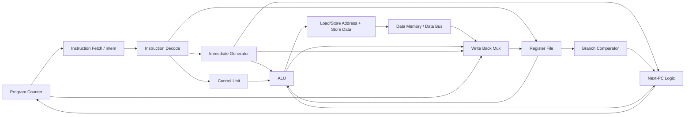
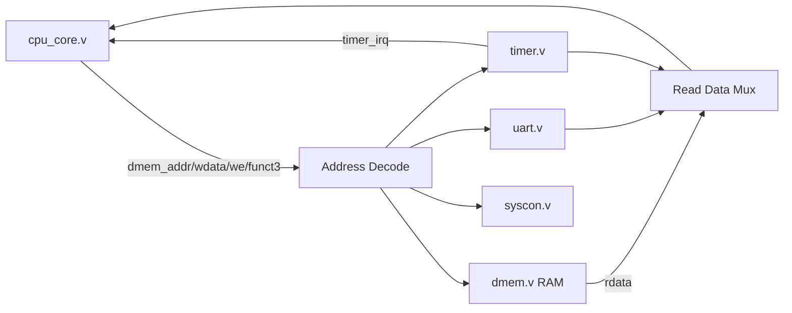
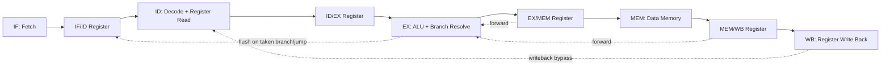
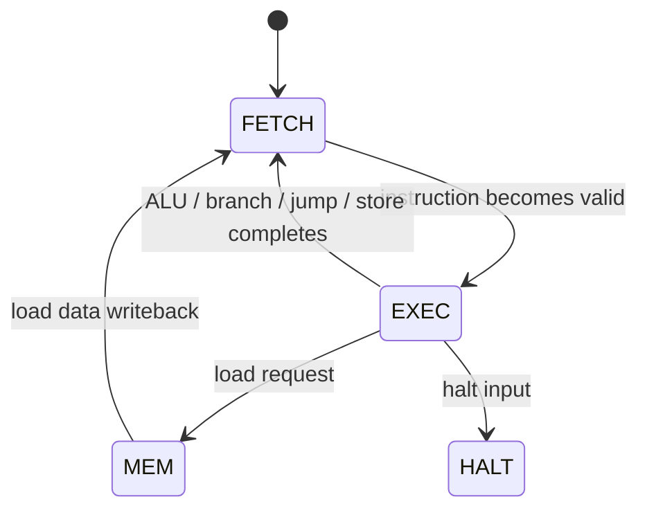
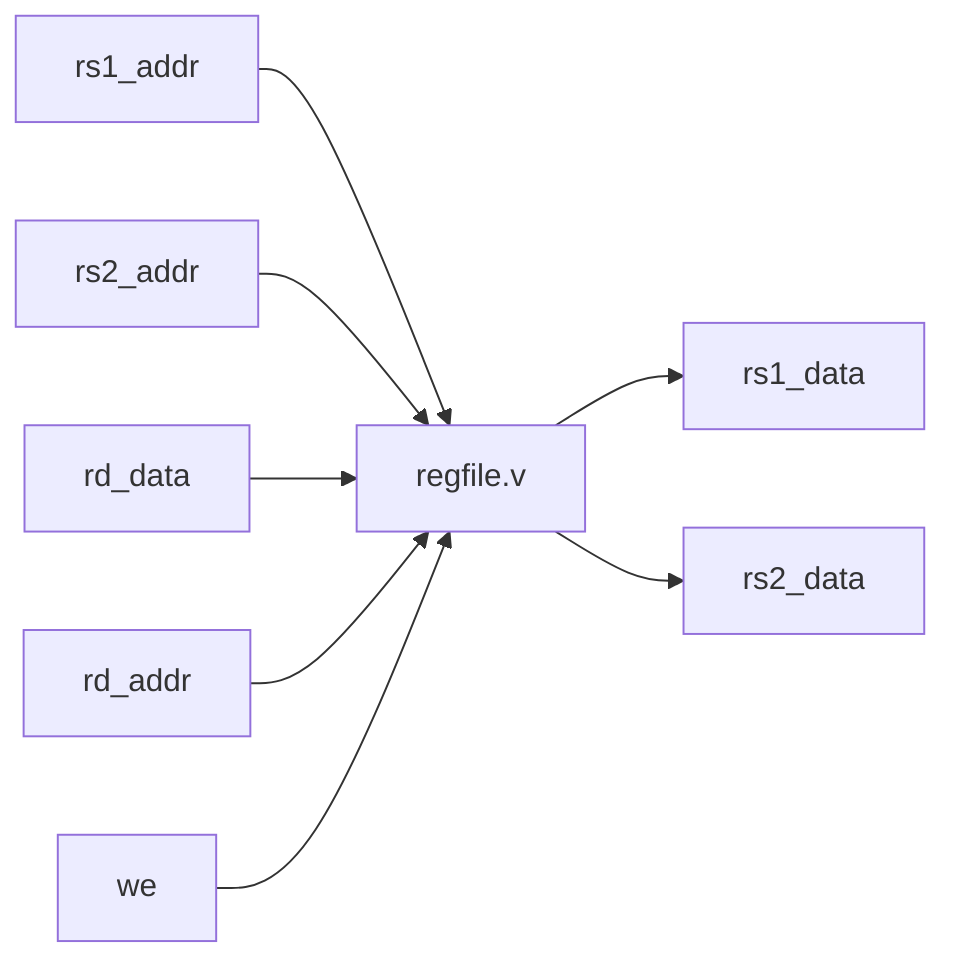
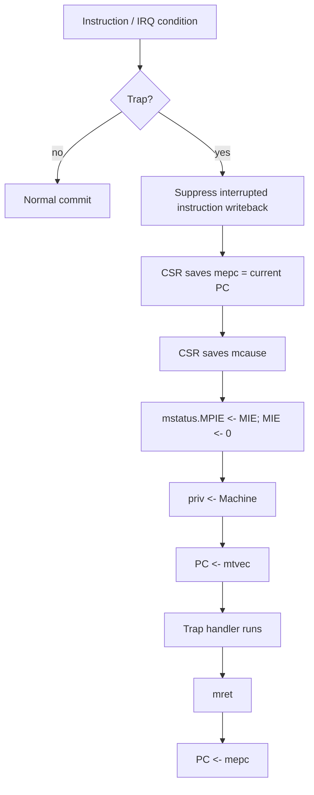
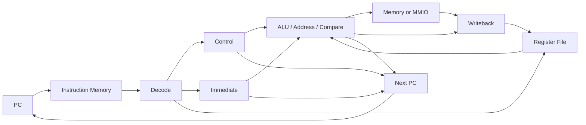

# RISC-V CPU Core Documentation

## 1. High-Level Overview

This repository implements a small educational RISC-V CPU family in Verilog. It starts with a simple single-cycle CPU and then grows into SoC, interrupt, multiply/divide, pipelined, MMU, FPGA, FreeRTOS, UART, debug, atomic, and branch-prediction variants.

The core is best understood as a tutorial-style CPU evolution rather than a single frozen microarchitecture:

| Variant | Main Top Module | Design Style | Main Purpose |
|---|---:|---:|---|
| Standalone teaching CPU | `rtl/cpu.v` | Single-cycle | Minimal CPU + internal instruction/data memories for simulation. |
| SoC CPU core | `rtl/cpu_core.v` | Single-cycle | CPU with external data bus, CSR/trap logic, timer interrupt input, and atomics. |
| Simulation SoC | `rtl/soc.v` | Single-cycle SoC | CPU core + RAM + UART + timer + syscon. |
| Pipelined CPU | `rtl/cpu_pipe.v` | 5-stage pipeline | RV32IM pipeline with forwarding, load-use stall, and branch flush. |
| Pipelined trap SoC core | `rtl/cpu_pipe_trap.v` | 5-stage pipeline | Pipeline extended with precise traps/interrupts and CSR support. |
| Branch-predicted pipeline | `rtl/cpu_pipe_bp.v` | 5-stage pipeline + predictor | Pipeline using `branch_predictor.v`. |
| FPGA/synthesis core | `rtl/cpu_mc.v` | Multi-cycle | BRAM-ready core for registered instruction/data memories. |
| MMU cores | `rtl/cpu_core_mmu.v`, `rtl/cpu_mc_mmu.v` | Single-cycle/multi-cycle MMU variants | Sv32 virtual-memory experiments. |
| FPGA top-levels | `rtl/fpga_top*.v`, `rtl/soc_*_fpga.v` | Synthesizable SoC wrappers | Zynq/FPGA deployment using BRAM and real UART pins. |

### ISA support summary

The codebase supports several ISA subsets depending on which CPU variant is built:

| Feature / Extension | Implemented In | Notes |
|---|---|---|
| RV32I base integer | `cpu.v`, `cpu_core.v`, `cpu_pipe.v`, `cpu_mc.v`, most variants | Arithmetic, logic, shifts, comparisons, load/store, branches, jumps, LUI/AUIPC. |
| RV32M multiply/divide | `alu.v`, `control.v`; used by RV32IM variants | `MUL`, `MULH`, `MULHSU`, `MULHU`, `DIV`, `DIVU`, `REM`, `REMU`. Implemented combinationally in `alu.v`. |
| Zicsr | `csr.v`, `cpu_core.v`, `cpu_mc.v`, trap/pipeline variants | Minimal machine-mode CSR support. |
| Machine timer interrupt | `timer.v` / `clint.v` + `csr.v` + core trap logic | Timer interrupt enters `mtvec`, saves `mepc`/`mcause`. |
| External interrupt | `csr.v`, `cpu_mc.v`, UART interrupt variants | Used by configurable UART interrupt SoCs. |
| Machine/User privilege | `csr.v`, privileged core variants | Tracks `cur_priv`, supports `mret`, blocks machine CSR access from user mode. |
| RV32A atomics | `control.v`, `cpu_core.v` | LR/SC and AMO read-modify-write support in the single-cycle SoC-oriented core. |
| Sv32 MMU | `mmu.v`, `cpu_core_mmu.v`, `cpu_mc_mmu.v` | Data-side translation/page-walk experiments. |
| Branch prediction | `branch_predictor.v`, `cpu_pipe_bp.v` | BTB + 2-bit saturating counters. |
| Compressed/F/D/V/RV64 | Not implemented | The README lists these as possible future directions. |

The design philosophy is intentionally readable and incremental. The CPU blocks are simple Verilog modules with self-checking testbenches in `tb/`, and the software examples in `sw/` generate `.hex` images for simulation or FPGA BRAM initialization.

---

## 2. Repository / File Structure

| File / Module | Purpose | Important Notes |
|---|---|---|
| `README.md` | Project roadmap and quick start | Describes the tutorial progression from RV32I single-cycle CPU to SoC, interrupts, RV32M, pipeline, MMU, FreeRTOS, debug, UART interrupts, and branch prediction. |
| `Makefile` | Simulation/build entry points | Defines targets such as `cpu`, `soc`, `muldiv`, `pipe`, `bpred`, `mmu`, `fpga`, `freertos`, etc. |
| `docs/*.md` | Tutorial documentation | Existing step-by-step docs for the CPU evolution. |
| `rtl/alu.v` | Arithmetic Logic Unit | Combinational RV32IM ALU. Includes multiply/divide and RV32M corner-case behavior. |
| `rtl/regfile.v` | Integer register file | 32 × 32-bit registers, two asynchronous read ports, one synchronous write port, hard-wired `x0`. |
| `rtl/imem.v` | Simulation instruction memory | Combinational ROM loaded with `$readmemh`; PC is byte-addressed, internally indexed by `addr >> 2`. |
| `rtl/dmem.v` | Simulation data memory / RAM | Byte-addressable little-endian memory. Supports `LB/LH/LW/LBU/LHU` and `SB/SH/SW`. Also exposes page-walk read ports for MMU variants. |
| `rtl/immgen.v` | Immediate generator | Generates I/S/B/U/J immediates and sign-extends them. |
| `rtl/control.v` | Main decoder/control unit | Decodes opcodes/funct fields into datapath controls, writeback select, immediate type, ALU operation, and memory controls. Includes RV32M and AMO decode hooks. |
| `rtl/cpu.v` | Standalone CPU top-level | Single-cycle core with internal `imem` and `dmem`. Good first file to read for the basic datapath. |
| `rtl/cpu_core.v` | SoC-oriented CPU core | Similar datapath to `cpu.v`, but exports a data bus and adds CSR/trap logic, timer interrupt handling, privilege checks, and atomics. |
| `rtl/soc.v` | Simulation SoC wrapper | Instantiates `cpu_core`, RAM, UART, timer, and syscon with a simple address decoder. |
| `rtl/csr.v` | CSR and trap controller | Implements minimal machine-mode CSRs, interrupt pending logic, trap entry, `mret`, `satp`, and privilege tracking. |
| `rtl/timer.v` | Simple timer peripheral | MMIO timer generating a timer interrupt. |
| `rtl/clint.v` | 64-bit CLINT-style timer | Used by FreeRTOS/RTOS variants expecting `mtime`/`mtimecmp`. |
| `rtl/uart.v` | Simulation UART | MMIO UART model for testbench output. |
| `rtl/uart_hw.v`, `rtl/uart_tx.v` | Synthesizable UART TX path | Drives a real serial TX pin in FPGA builds. |
| `rtl/uart_full.v`, `rtl/uart_rx.v`, `rtl/uart_tx_cfg.v` | Configurable UART with RX/TX | Runtime baud/data/parity/stop configuration and interrupt-capable receive path. |
| `rtl/syscon.v` | System-control peripheral | Simulation halt/finish or FPGA halt indicator depending on wrapper. |
| `rtl/cpu_pipe.v` | Pipelined CPU | Classic 5-stage RV32IM pipeline with forwarding, load-use stalls, and branch flushes. No CSR/interrupts in this base file. |
| `rtl/cpu_pipe_trap.v` | Pipelined CPU with traps | Adds precise exceptions/interrupts and CSR support to the pipeline. |
| `rtl/cpu_pipe_bp.v` | Pipelined CPU with branch predictor | Uses `branch_predictor.v` to reduce branch penalty. |
| `rtl/branch_predictor.v` | Branch predictor | Direct-mapped BTB plus 2-bit saturating counters. |
| `rtl/cpu_mc.v` | Multi-cycle CPU | BRAM-ready RV32IM + CSR/privilege core. Fetch/execute/memory states handle registered memory latency. |
| `rtl/cpu_mc_mmu.v` | Multi-cycle CPU with MMU | Adds a multi-cycle Sv32 page-table walker using the normal data port. |
| `rtl/cpu_core_mmu.v` | Single-cycle CPU with MMU | Uses `mmu.v` and extra page-walk RAM read ports. |
| `rtl/mmu.v` | Sv32 MMU helper | Translates data addresses using page-table entries. |
| `rtl/bram_rom.v`, `rtl/bram_ram.v` | Synthesizable BRAM memories | Registered-read instruction ROM and byte-write data RAM for FPGA builds. |
| `rtl/soc_fpga.v` | Synthesizable FPGA SoC | Uses `cpu_mc`, BRAMs, real UART, timer, and halt LED. |
| `rtl/fpga_top.v` | FPGA top using `cpu_core` | Direct top-level with real UART TX and LEDs. |
| `rtl/fpga_top_full.v` | Zynq-7010 top wrapper | Wraps `soc_fpga` for a 125 MHz Zynq-style board. |
| `rtl/soc_rtos.v` | Simulation RTOS SoC | Larger RAM/ROM and CLINT for FreeRTOS experiments. |
| `rtl/soc_rtos_fpga.v`, `rtl/fpga_top_rtos.v` | FreeRTOS FPGA SoC/top | Multi-cycle BRAM core plus 64-bit CLINT and real UART. |
| `rtl/debug_module.v`, `rtl/cpu_core_dbg.v`, `rtl/soc_dbg.v` | Debug support | Hardware debug module, halt/step/breakpoints, and debug-aware SoC wrapper. |
| `tb/*.v` | Testbenches | Self-checking tests for modules, cores, SoCs, pipeline, MMU, UART, FreeRTOS, etc. |
| `sw/*.c`, `sw/*.s`, `sw/*.hex` | Bare-metal programs and images | RISC-V test/demo programs and generated hex files used by testbenches. |
| `sw/freertos/*` | FreeRTOS port/demo scaffolding | FreeRTOS configuration, linker scripts, startup, and demo program. |
| `constraints/*.xdc` | FPGA constraints | Zynq board pin/clock constraints. |

---

## 3. CPU Architecture Overview

This project contains **three architectural styles**:

1. **Single-cycle CPU**: `rtl/cpu.v` and the single-cycle datapath inside `rtl/cpu_core.v`.
2. **Multi-cycle CPU**: `rtl/cpu_mc.v` and `rtl/cpu_mc_mmu.v`, intended for FPGA block RAM with registered reads.
3. **Pipelined CPU**: `rtl/cpu_pipe.v`, `rtl/cpu_pipe_trap.v`, and `rtl/cpu_pipe_bp.v`, using a classic 5-stage pipeline.

The simplest CPU is `rtl/cpu.v`. It fetches, decodes, executes, accesses memory, computes the next PC, and writes back in one clock cycle. This makes it very easy to understand, but it also means the clock period must be long enough for the entire instruction path.



For the SoC-oriented core (`cpu_core.v`), the internal data memory is removed and replaced by an external data bus. `soc.v` then decodes the data address and routes the access to RAM, UART, timer, or syscon.



The pipelined core (`cpu_pipe.v`) splits execution into five stages:



---

## 4. Top-Level CPU Modules

### `rtl/cpu.v` — standalone single-cycle CPU

`cpu.v` is the easiest top-level to read first. It contains:

- Program counter register.
- Internal `imem` instance for instruction fetch.
- Instruction field extraction.
- `control` decoder.
- `immgen` immediate generator.
- `regfile` instance.
- `alu` instance.
- Internal `dmem` instance.
- Branch comparator.
- Next-PC logic.
- Writeback mux.

This module is standalone: instruction memory and data memory are inside the CPU top, so it is convenient for simulation and waveform learning.

### `rtl/cpu_core.v` — SoC-oriented core

`cpu_core.v` is the practical system core. It keeps instruction fetch internal through `imem`, but exposes the data side as a simple memory/peripheral bus:

```verilog
output wire [31:0] dmem_addr,
output wire [31:0] dmem_wdata,
output wire        dmem_we,
output wire [2:0]  dmem_funct3,
input  wire [31:0] dmem_rdata
```

It also adds features that are not in the minimal `cpu.v` datapath:

- CSR instruction decode.
- `mret`, `ecall`, and `ebreak` recognition.
- Illegal-instruction detection.
- Machine/user privilege checks.
- Timer interrupt handling.
- Trap entry via `mtvec` and return via `mepc`.
- Atomic operations using LR/SC reservation and AMO read-modify-write logic.

### `rtl/soc.v` — simulation SoC top

`soc.v` instantiates `cpu_core.v` and gives it a memory map:

| Address Region | Device |
|---|---|
| `0x0000_0000 .. 0x0FFF_FFFF` | RAM, implemented using `dmem.v` |
| `0x1000_0000 .. 0x1000_FFFF` | UART |
| `0x1001_0000 .. 0x1001_FFFF` | Timer |
| `0x2000_0000 .. 0x2FFF_FFFF` | Syscon / halt |

### FPGA top-levels

For actual FPGA synthesis, the most relevant wrappers are:

- `rtl/fpga_top.v`: direct FPGA top with `cpu_core`, data RAM, real UART TX, timer, and LEDs.
- `rtl/soc_fpga.v`: more synthesis-oriented SoC using `cpu_mc` and BRAMs.
- `rtl/fpga_top_full.v`: Zynq-7010 wrapper around `soc_fpga`.
- `rtl/fpga_top_rtos.v`: FreeRTOS FPGA wrapper around `soc_rtos_fpga`.

The FPGA-friendly path uses `cpu_mc.v` because FPGA block RAM normally has registered read latency, which is not compatible with the purely combinational fetch/data-read assumptions of the single-cycle teaching core.

---

## 5. Instruction Fetch

### Single-cycle fetch

Implemented in:

- `rtl/cpu.v`
- `rtl/cpu_core.v`
- `rtl/cpu_pipe.v`
- `rtl/cpu_core_mmu.v`

The program counter is a 32-bit register. In the simple core, the next PC is selected combinationally and loaded on the rising clock edge:

```text
normal instruction: PC <- PC + 4
branch taken:       PC <- PC + immediate
jal:                PC <- PC + immediate
jalr:               PC <- (rs1 + immediate) & ~1
trap:               PC <- mtvec
mret:               PC <- mepc
```

`imem.v` is a word array loaded from a hex file. The input address is a byte address, so the memory index drops the low two bits:

```text
word_index = addr[IDX+1:2]
```

### Multi-cycle fetch

Implemented in:

- `rtl/cpu_mc.v`
- `rtl/cpu_mc_mmu.v`

The multi-cycle core has explicit states because BRAM reads are registered:



The important point is that the multi-cycle core trades CPI for synthesizability and timing friendliness.

---

## 6. Instruction Decode and Control Unit

Instruction field extraction is done directly from the 32-bit instruction in the CPU top modules:

| Field | Bits |
|---|---:|
| `opcode` | `[6:0]` |
| `rd` | `[11:7]` |
| `funct3` | `[14:12]` |
| `rs1` | `[19:15]` |
| `rs2` | `[24:20]` |
| `funct7` | `[31:25]` |

`rtl/control.v` is a pure combinational decoder. It consumes `opcode`, `funct3`, and `funct7`, and produces the control signals used by the datapath.

| Control Signal | Meaning |
|---|---|
| `reg_write` | Enable writeback into `rd`. |
| `alu_src_a` | Select ALU input A: `0 = rs1`, `1 = PC`. Used by `AUIPC`. |
| `alu_src_b` | Select ALU input B: `0 = rs2`, `1 = immediate`. |
| `mem_read` | Instruction is a load or AMO-style memory read. |
| `mem_write` | Instruction is a store. |
| `branch` | Instruction is conditional branch. |
| `jump` | Instruction is `JAL` or `JALR`. |
| `jalr` | Selects `JALR` target calculation. |
| `wb_sel` | Selects writeback source: ALU, memory, PC+4, or immediate. |
| `imm_type` | Selects immediate format: I/S/B/U/J. |
| `alu_op` | Selects ALU operation. |

The decoder recognizes these major opcode groups:

| Opcode Group | RISC-V Instructions |
|---|---|
| `OP_R` | Register-register ALU and RV32M multiply/divide. |
| `OP_I` | Immediate ALU instructions. |
| `OP_LOAD` | Loads. |
| `OP_STORE` | Stores. |
| `OP_BR` | Conditional branches. |
| `OP_JAL` | `jal`. |
| `OP_JALR` | `jalr`. |
| `OP_LUI` | `lui`. |
| `OP_AUIPC` | `auipc`. |
| `OP_AMO` | Atomic extension hooks. |

---

## 7. Register File

Implemented in `rtl/regfile.v`.

The register file contains the standard RISC-V integer register set:

- 32 registers.
- 32 bits per register.
- Two asynchronous read ports: `rs1_data`, `rs2_data`.
- One synchronous write port: `rd_data` written on the rising clock edge.
- Register `x0` is hard-wired to zero.

This is a good fit for the single-cycle CPU because register operands must be available combinationally in the same cycle that the instruction is fetched and decoded.



---

## 8. Immediate Generator

Implemented in `rtl/immgen.v`.

RISC-V keeps register fields in fixed positions, so immediate bits are scattered across different instruction fields. `immgen.v` reconstructs and sign-extends the immediate.

| Immediate Type | Used By | Construction |
|---|---|---|
| I-type | ALU immediates, loads, `jalr`, CSR immediate source field handling elsewhere | `instr[31:20]` sign-extended. |
| S-type | Stores | `{instr[31:25], instr[11:7]}` sign-extended. |
| B-type | Branches | `{instr[31], instr[7], instr[30:25], instr[11:8], 0}` sign-extended. |
| U-type | `lui`, `auipc` | `{instr[31:12], 12'b0}`. |
| J-type | `jal` | `{instr[31], instr[19:12], instr[20], instr[30:21], 0}` sign-extended. |

---

## 9. ALU and Multiplier/Divider

Implemented in `rtl/alu.v`.

The ALU is combinational and receives two 32-bit operands plus a 5-bit `alu_op` value from the control unit.

### Base integer operations

| Operation | Instruction Family |
|---|---|
| `ADD`, `SUB` | `add`, `sub`, address calculation, `addi` |
| `AND`, `OR`, `XOR` | Logical operations |
| `SLL`, `SRL`, `SRA` | Shift operations |
| `SLT`, `SLTU` | Signed/unsigned comparisons |

### RV32M operations

| ALU Operation | RISC-V Instruction |
|---|---|
| `ALU_MUL` | `mul` |
| `ALU_MULH` | `mulh` |
| `ALU_MULHSU` | `mulhsu` |
| `ALU_MULHU` | `mulhu` |
| `ALU_DIV` | `div` |
| `ALU_DIVU` | `divu` |
| `ALU_REM` | `rem` |
| `ALU_REMU` | `remu` |

The multiply/divide implementation is written for clarity using Verilog `*`, `/`, and `%`. This is fine for teaching and simulation. On an FPGA, multipliers can map to DSP blocks, but a fully combinational divider can be large and slow. A production core would usually make divide multi-cycle.

---

## 10. Branch and Jump Unit

Branch/jump behavior is not isolated into a separate module. It is implemented directly inside each CPU top.

Implemented in:

- `rtl/cpu.v`
- `rtl/cpu_core.v`
- `rtl/cpu_pipe.v`
- `rtl/cpu_pipe_trap.v`
- `rtl/cpu_pipe_bp.v`
- `rtl/cpu_mc.v`
- `rtl/cpu_mc_mmu.v`

The branch comparator uses `funct3`:

| `funct3` | Branch | Condition |
|---:|---|---|
| `000` | `beq` | `rs1 == rs2` |
| `001` | `bne` | `rs1 != rs2` |
| `100` | `blt` | signed `<` |
| `101` | `bge` | signed `>=` |
| `110` | `bltu` | unsigned `<` |
| `111` | `bgeu` | unsigned `>=` |

Next-PC priority in the richer single-cycle core is:

1. Trap: `next_pc = mtvec`.
2. `mret`: `next_pc = mepc`.
3. `jalr`: `next_pc = (rs1 + imm) & ~1`.
4. `jal`: `next_pc = pc + imm`.
5. Taken branch: `next_pc = pc + imm`.
6. Otherwise: `next_pc = pc + 4`.

In the base pipeline, branches and jumps resolve in the EX stage. The core predicts not-taken, so a taken branch/jump flushes the two younger instructions behind it.

---

## 11. Load/Store Unit and Data Memory Interface

There is no dedicated `lsu.v`; load/store behavior is distributed across the CPU top and memory/bus modules.

### In the standalone CPU

`rtl/cpu.v` instantiates `dmem.v` internally:

```text
address = alu_result
store data = rs2_data
width/sign = funct3
write enable = mem_write
read data = mem_rdata
```

### In the SoC core

`rtl/cpu_core.v` exports a simple data bus:

| Signal | Direction | Meaning |
|---|---|---|
| `dmem_addr` | CPU → SoC | Byte address. Usually ALU result. For atomics, `rs1`. |
| `dmem_wdata` | CPU → SoC | Store data or AMO writeback value. |
| `dmem_we` | CPU → SoC | Write strobe. Single bit in simulation-oriented bus. |
| `dmem_funct3` | CPU → SoC | Load/store width and signedness. |
| `dmem_rdata` | SoC → CPU | Read data from RAM or peripheral. |

`soc.v` performs address decoding and multiplexes read data back to the CPU.

### In the multi-cycle FPGA core

`rtl/cpu_mc.v` uses a BRAM-style byte-write bus:

| Signal | Meaning |
|---|---|
| `dmem_addr` | Byte address. |
| `dmem_we[3:0]` | Per-byte write enable. |
| `dmem_wdata` | Store data aligned for BRAM word writes. |
| `dmem_rdata` | Registered read data. |

This is more synthesis-friendly than the single-cycle simulation memory interface.

---

## 12. CSR, Trap, Interrupt, and Privilege Unit

Implemented mainly in:

- `rtl/csr.v`
- `rtl/cpu_core.v`
- `rtl/cpu_mc.v`
- `rtl/cpu_pipe_trap.v`
- `rtl/cpu_core_mmu.v`
- `rtl/cpu_mc_mmu.v`

`csr.v` holds machine-mode control/status registers and implements trap side effects.

### Supported CSRs

| CSR | Address | Purpose |
|---|---:|---|
| `mstatus` | `0x300` | Contains `MIE`, `MPIE`, and `MPP` fields used for trap entry/return. |
| `mie` | `0x304` | Machine interrupt enables: timer and external interrupt bits. |
| `mtvec` | `0x305` | Trap handler base address, direct mode. |
| `mscratch` | `0x340` | Scratch register for trap handlers. |
| `mepc` | `0x341` | Saved PC on trap. |
| `mcause` | `0x342` | Trap/interrupt cause. |
| `mip` | `0x344` | Read-only pending bits for timer/external interrupt. |
| `satp` | `0x180` | Address-translation control for MMU variants. |

### Trap flow



### Supported exceptions and interrupts

| Event | Cause |
|---|---:|
| Illegal instruction | `2` |
| Breakpoint / `ebreak` | `3` |
| User `ecall` | `8` |
| Machine `ecall` | `11` |
| Machine timer interrupt | `0x80000007` |
| Machine external interrupt | `0x8000000B` in `csr.v`; used by UART interrupt variants. |

The core treats illegal instructions and synchronous exceptions as unmaskable. Timer/external interrupts are gated by `mstatus.MIE` and `mie` enable bits.

---

## 13. Atomic Extension Support

Atomic decode is present in `rtl/control.v`, and the main single-cycle SoC core implements atomic behavior in `rtl/cpu_core.v`.

Supported behavior includes:

- `LR.W`: loads a word and records a reservation address.
- `SC.W`: stores only if the reservation is still valid; writes `0` to `rd` on success and `1` on failure.
- AMO read-modify-write operations:
  - `AMOSWAP`
  - `AMOADD`
  - `AMOXOR`
  - `AMOAND`
  - `AMOOR`
  - `AMOMIN`
  - `AMOMAX`
  - `AMOMINU`
  - `AMOMAXU`

The implementation is a single-hart teaching implementation. The reservation is tracked as one valid address inside the core. In a real multi-hart system, the reservation would need coherence with other masters and memory writes.

---

## 14. Pipeline Registers, Hazards, Forwarding, and Stalls

Implemented in `rtl/cpu_pipe.v`, with richer variants in `rtl/cpu_pipe_trap.v` and `rtl/cpu_pipe_bp.v`.

### Pipeline stages

| Stage | Main Work |
|---|---|
| IF | Fetch instruction from `imem` using `pc`. |
| ID | Decode fields, run `control`, generate immediate, read register file. |
| EX | Select/forward operands, run ALU, resolve branch/jump. |
| MEM | Access `dmem` for loads/stores. |
| WB | Write result back to register file. |

### Pipeline registers

| Register | Between Stages | Purpose |
|---|---|---|
| `IF/ID` | IF → ID | Holds fetched instruction and PC. |
| `ID/EX` | ID → EX | Holds decode outputs, operands, register indexes, immediate, and control signals. |
| `EX/MEM` | EX → MEM | Holds ALU result/address, store data, destination register, and memory controls. |
| `MEM/WB` | MEM → WB | Holds final writeback value and destination register. |

### Data hazards

The pipeline handles common RAW hazards using:

1. **EX/MEM forwarding** into EX operands.
2. **MEM/WB forwarding** into EX operands.
3. **WB-to-ID bypass** for a register written in WB and read in ID in the same cycle.

### Load-use hazard

A load result is not ready until MEM, so an immediately dependent instruction must stall one cycle.

```text
load_use = idex_mem_read && idex_rd != x0 &&
           (idex_rd == rs1_id || idex_rd == rs2_id)
```

When `load_use` is true:

- The PC is held.
- The IF/ID register is held.
- A bubble is inserted into ID/EX.

### Control hazards

The base pipeline predicts not-taken. Branches and jumps resolve in EX. If the branch/jump is taken, IF/ID and ID/EX are flushed so wrong-path instructions do not commit.

### Branch predictor variant

`rtl/branch_predictor.v` implements:

- A direct-mapped branch target buffer.
- A 2-bit saturating direction counter per entry.
- Prediction from the IF PC.
- Update when the branch outcome and target are known.

`rtl/cpu_pipe_bp.v` integrates this predictor into the pipelined datapath.

---

## 15. MMU / Virtual Memory Support

The MMU work appears in:

- `rtl/mmu.v`
- `rtl/cpu_core_mmu.v`
- `rtl/cpu_mc_mmu.v`
- `rtl/soc_mmu.v`
- `rtl/soc_fpga_mmu.v`

The design implements Sv32-style data address translation experiments. The CSR block exposes `satp`, and the MMU variants use it to translate virtual addresses into physical addresses.

There are two approaches:

| Module | Approach |
|---|---|
| `cpu_core_mmu.v` | Single-cycle style MMU using extra RAM read ports for page-table walking. |
| `cpu_mc_mmu.v` | Multi-cycle page-table walker using the normal registered data port. |

The multi-cycle MMU is closer to realistic synthesizable hardware because it sequences page-table reads over several states instead of assuming extra combinational memory ports.

---

## 16. Memory Map and Peripherals

The main simulation SoC address map is implemented in `rtl/soc.v`:

| Address Range | Device | Module |
|---|---|---|
| `0x0000_0000 .. 0x0FFF_FFFF` | RAM | `dmem.v` |
| `0x1000_0000 .. 0x1000_FFFF` | UART | `uart.v` / `uart_hw.v` / `uart_full.v` depending on wrapper |
| `0x1001_0000 .. 0x1001_FFFF` | Timer / CLINT | `timer.v` or `clint.v` |
| `0x2000_0000 .. 0x2FFF_FFFF` | Syscon / halt | `syscon.v` or halt register in FPGA wrapper |

The SoC bus is intentionally simple: one address, one write-data path, one write-enable, one function/width field, and a read-data mux.

---

## 17. Execution Flow of a Single-Cycle Instruction

For an ALU instruction such as `add x3, x1, x2`:

1. `pc` addresses `imem`.
2. Instruction fields are extracted.
3. `control.v` detects an R-type instruction and selects the correct ALU operation.
4. `regfile.v` reads `x1` and `x2`.
5. `alu.v` computes `x1 + x2`.
6. Writeback mux selects the ALU result.
7. Register file writes `x3` on the clock edge.
8. PC updates to `pc + 4`.

For a load such as `lw x5, 8(x1)`:

1. `immgen.v` generates the I-type offset.
2. ALU computes `x1 + imm`.
3. Data memory or SoC bus reads the word at that address.
4. Writeback mux selects memory read data.
5. Register file writes `x5`.
6. PC updates to `pc + 4`.

For a branch such as `beq x1, x2, label`:

1. `immgen.v` generates the B-type branch offset.
2. Comparator checks `x1 == x2`.
3. If true, `next_pc = pc + imm`; otherwise `next_pc = pc + 4`.
4. No register writeback occurs.

---

## 18. How to Read the Codebase

Recommended reading order:

1. `rtl/alu.v` — learn the operation encoding and RV32M behavior.
2. `rtl/regfile.v` — understand architectural register storage.
3. `rtl/imem.v` and `rtl/dmem.v` — understand instruction/data memory assumptions.
4. `rtl/immgen.v` — understand immediate reconstruction.
5. `rtl/control.v` — understand instruction decoding.
6. `rtl/cpu.v` — read the complete single-cycle datapath in one file.
7. `rtl/cpu_core.v` — see how the core becomes a bus master and gains traps/CSRs/atomics.
8. `rtl/soc.v` — see how RAM/peripherals connect around the core.
9. `rtl/cpu_pipe.v` — study the 5-stage version and hazard logic.
10. `rtl/cpu_mc.v` — study the BRAM/synthesis-friendly multi-cycle version.
11. `rtl/csr.v` — study interrupts, traps, `mret`, and privilege handling.
12. `rtl/mmu.v` and MMU core variants — study virtual-memory extensions.
13. `rtl/fpga_top*.v` — study board-level integration.

---

## 19. Module-to-Architecture Mapping

| Architectural Block | Actual File(s) / Module(s) | Notes |
|---|---|---|
| Program Counter | `cpu.v`, `cpu_core.v`, `cpu_pipe.v`, `cpu_mc.v`, variants | Implemented inside each core, not as a separate `pc.v`. |
| Instruction Fetch | `imem.v`, `bram_rom.v`, core PC logic | Simulation cores use combinational `imem`; FPGA cores use registered BRAM ROM. |
| Instruction Decoder | Field extraction in CPU modules + `control.v` | Fields are wires; main control decode is a module. |
| Control Unit | `control.v` | Combinational opcode/funct decoder. |
| Register File | `regfile.v` | 32 × 32-bit, x0 hard-wired zero. |
| Immediate Generator | `immgen.v` | I/S/B/U/J immediates. |
| ALU | `alu.v` | RV32I integer ops plus RV32M multiply/divide. |
| Branch/Jump Unit | Inline in CPU modules | Comparator and next-PC mux are inside each CPU top. |
| Load/Store Unit | Inline in CPU modules + `dmem.v` / SoC bus | No separate `lsu.v`; address generation uses ALU. |
| Data Memory | `dmem.v`, `bram_ram.v` | `dmem.v` for simulation/combinational reads; `bram_ram.v` for FPGA registered reads. |
| Memory Interface / Bus | `cpu_core.v`, `soc.v`, FPGA SoCs | Simple address decode and read-data mux. |
| CSR Unit | `csr.v` | Machine CSRs, traps, interrupts, privilege, `satp`. |
| Interrupt/Trap Unit | `csr.v` + core trap decode | Exception cause priority and PC redirection live in the core; CSR side effects live in `csr.v`. |
| Multiplier/Divider | `alu.v` | Combinational RV32M implementation. |
| Atomic Unit | `cpu_core.v` + `control.v` | LR/SC reservation and AMO RMW logic implemented inline. |
| Pipeline Registers | `cpu_pipe.v`, `cpu_pipe_trap.v`, `cpu_pipe_bp.v` | IF/ID, ID/EX, EX/MEM, MEM/WB registers. |
| Hazard Logic | `cpu_pipe.v`, pipeline variants | Forwarding, WB-to-ID bypass, load-use stall, branch flush. |
| Branch Predictor | `branch_predictor.v`, `cpu_pipe_bp.v` | BTB + 2-bit counters. |
| MMU | `mmu.v`, `cpu_core_mmu.v`, `cpu_mc_mmu.v` | Sv32 data-side translation/page walking. |
| Timer | `timer.v`, `clint.v` | Simple timer and CLINT-style 64-bit timer. |
| UART | `uart.v`, `uart_hw.v`, `uart_full.v` | Simulation UART, hardware TX, and configurable RX/TX UART. |
| Debug | `debug_module.v`, `cpu_core_dbg.v`, `soc_dbg.v` | Halt/step/breakpoint support and GDB stub infrastructure. |

---

## 20. Notes and Limitations

- The repository intentionally contains multiple CPU variants. When documenting or modifying behavior, always identify which top module your testbench or FPGA wrapper uses.
- `cpu.v` is the simplest learning core, but `cpu_core.v` and `soc.v` are more representative of a usable SoC design.
- The single-cycle design assumes combinational instruction and data memory reads. This is convenient for simulation but not ideal for FPGA BRAM.
- `cpu_mc.v` is the better FPGA-oriented core because it supports registered memory latency.
- The ALU divider is combinational. It is simple but can become a large/slow hardware path.
- The base pipeline in `cpu_pipe.v` does not include CSR/interrupt logic; use `cpu_pipe_trap.v` for precise trap support.
- Atomics are implemented as a teaching/single-hart mechanism. A real multi-hart design would require reservation invalidation and memory coherence rules.
- The MMU support is experimental/tutorial-oriented and primarily focused on data translation/page walking.
- No caches are present in the inspected RTL.
- No compressed instruction fetch (`C` extension), floating point (`F/D`), vector (`V`), or RV64 datapath is implemented.

---

## 21. Quick Reference: Which Top Should I Use?

| Goal | Use This Top / Target |
|---|---|
| Learn the basic datapath | `rtl/cpu.v`, Make target `cpu` |
| Run simple assembly/C in simulation | `rtl/cpu.v` or `rtl/soc.v` depending on peripherals needed |
| Use UART/timer/syscon in simulation | `rtl/soc.v`, Make target `soc` |
| Test RV32M multiply/divide | `rtl/soc.v` with `sw/muldiv_demo.c`, Make target `muldiv` |
| Study a 5-stage pipeline | `rtl/cpu_pipe.v`, Make target `pipe` or `pipe-sum` |
| Study traps in a pipeline | `rtl/cpu_pipe_trap.v`, Make targets like `pipe-irq`, `pipe-ecall`, `pipe-illegal` |
| Study branch prediction | `rtl/cpu_pipe_bp.v`, Make target `bpred` |
| Study Sv32 MMU | `rtl/soc_mmu.v` / `rtl/cpu_core_mmu.v`, Make target `mmu` |
| Synthesize for FPGA | `rtl/fpga_top_full.v` or `rtl/soc_fpga.v` |
| Run FreeRTOS experiments | `rtl/soc_rtos.v`, `rtl/soc_rtos_fpga.v`, `rtl/fpga_top_rtos.v` |
| Use configurable UART RX/TX interrupts | `rtl/soc_uart_fpga.v` and UART interrupt targets |

---

## 22. Final Mental Model

At its core, the CPU follows the normal RISC-V datapath pattern:



The rest of the repository expands this mental model in useful directions:

- `cpu_core.v` turns the standalone CPU into a SoC bus master.
- `csr.v` adds traps, interrupts, and privilege state.
- `alu.v` and `control.v` add RV32M multiply/divide.
- `cpu_pipe.v` converts the datapath into a 5-stage pipeline and adds hazard handling.
- `branch_predictor.v` improves the pipeline control path.
- `cpu_mc.v` makes the design friendlier to FPGA block RAM.
- `mmu.v` and MMU core variants introduce virtual memory.
- `soc_*` and `fpga_top_*` wrappers connect the core to RAM, UART, timers, syscon, CLINT, and board pins.

This makes the codebase a strong educational RISC-V platform: it starts as a demystified RV32I/RV32IM datapath and grows step-by-step toward a realistic embedded SoC.
